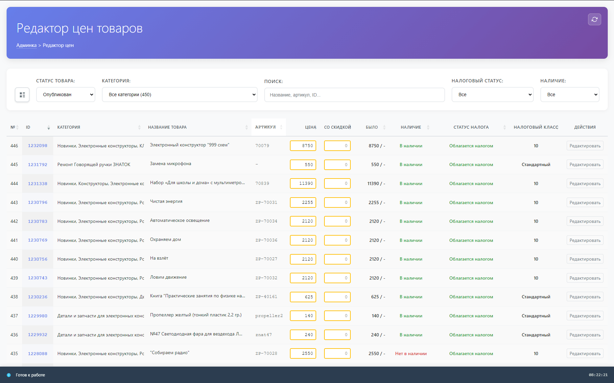
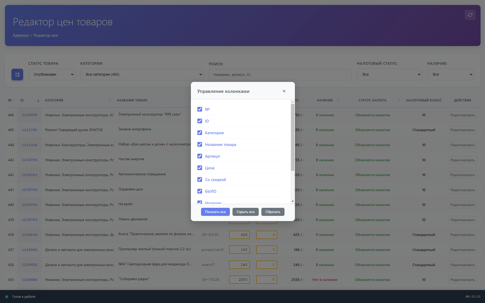
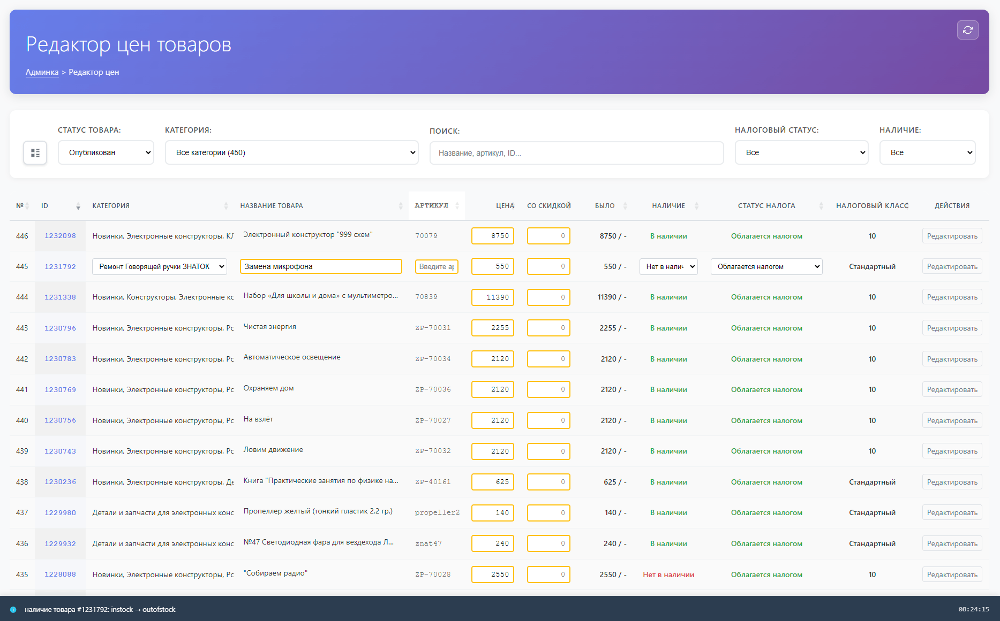

# DarkTech Price Editor

**Version:** 1.0.0  
**Author:** DarkTech  
**Website:** [darktech.ru](https://darktech.ru)  
**Repository:** [github.com/DarkTechCode/darktech-price-editor](https://github.com/DarkTechCode/darktech-price-editor)  
**License:** GPL-2.0-or-later

## Description

DarkTech Price Editor is a WordPress plugin for WooCommerce that helps store managers update product data in bulk through a fullscreen admin interface. It is designed for fast day-to-day work with large catalogs where prices, stock status, tax settings, and other product fields need to be edited without jumping between multiple product pages.

## Key Features

- Inline editing directly inside the product table
- Fullscreen workspace focused on bulk product management
- Search by product ID, title, or SKU
- Filters for publication status, category, stock status, and tax status
- Configurable column visibility
- Change history popup with the latest 100 saved actions
- Responsive interface for desktop and tablet use
- Local caching for categories and tax classes, with manual cache reset
- AJAX-based updates with nonce and capability checks
- Localized admin interface with 15 bundled translation packs

## Supported Languages

The plugin follows the current WordPress admin locale. Translation files are stored in [`languages/`](languages/).

Bundled locales:

- `ar` (Arabic)
- `de_DE` (German)
- `en_US` (English)
- `es_ES` (Spanish)
- `fr_FR` (French)
- `hi_IN` (Hindi)
- `id_ID` (Indonesian)
- `it_IT` (Italian)
- `ja` (Japanese)
- `ko_KR` (Korean)
- `nl_NL` (Dutch)
- `pt_BR` (Portuguese, Brazil)
- `ru_RU` (Russian)
- `tr_TR` (Turkish)
- `zh_CN` (Chinese, Simplified)

## Screenshots

### Screenshot 1



### Screenshot 2



### Screenshot 3



## Requirements

- WordPress 6.2+
- WooCommerce 5.0+
- PHP 7.4+

## Installation

1. Download the plugin.
2. Upload the folder `darktech-price-editor` to `/wp-content/plugins/`.
3. Activate the plugin in WordPress admin.

## Usage

Open **Price Editor** from the WordPress admin menu to launch the fullscreen interface.

Typical workflow:

- Filtering products by status, category, stock status, and tax status
- Searching by product ID, title, or SKU
- Editing values directly in table cells
- Saving with `Enter` and cancelling with `Esc`
- Clicking the bottom status bar to review the latest 100 saved changes
- Showing or hiding columns based on your workflow

After activation, the plugin adds a dedicated admin menu item for quick access to the editor.

## Change History

The status bar at the bottom of the editor keeps showing the latest action, and it now also opens a fullscreen change history popup when clicked.

The popup displays the latest 100 saved changes in three columns:

- Date and time
- What happened
- Author

History is stored in the WordPress database table `{wp_prefix}darktech_price_editor_logs`.

## Editable Fields

The plugin currently supports inline editing for:

- Product title
- SKU
- Category
- Regular price
- Sale price
- Stock status
- Tax status
- Tax class

Read-only columns include row number, product ID, old price, and action links.

## Project Structure

```text
darktech-price-editor/
|-- darktech-price-editor.php
|-- includes/
|   |-- i18n.php
|   |-- class-price-editor-history-repository.php
|   |-- class-price-editor-history-service.php
|   `-- class-price-editor.php
|-- templates/
|   `-- fullscreen-page.php
|-- assets/
|   |-- css/
|   |-- js/
|   |   `-- price_editor.history.js
|   `-- screenshots/
|-- languages/
|-- docs/
|   `-- readme.md
`-- readme.md
```

## Developer Notes

The plugin uses the WordPress AJAX API and requires the `edit_products` capability.

Registered AJAX actions:

- `darktech_pe_get_categories`
- `darktech_pe_get_tax_classes`
- `darktech_pe_get_products`
- `darktech_pe_get_change_history`
- `darktech_pe_update_product`

Requests are handled through `wp-admin/admin-ajax.php`.

## Security

- Nonce verification for AJAX requests
- Capability checks via `current_user_can('edit_products')`
- Sanitization of incoming request data
- Direct access protection for PHP files

## Support

Developed by **DarkTech**.  
For support, bug reports, or feature requests, visit [darktech.ru](https://darktech.ru), the [GitHub repository](https://github.com/DarkTechCode/darktech-price-editor), or github@darktech.ru.

## License

This project is distributed under the GPL v2 or later license.
